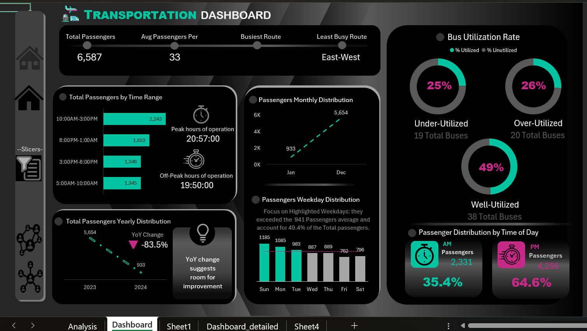
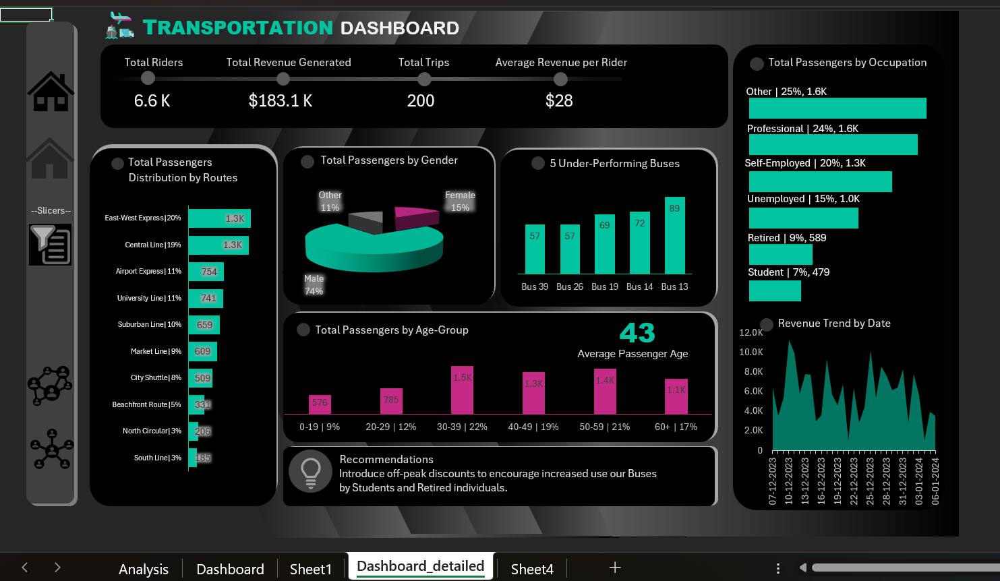
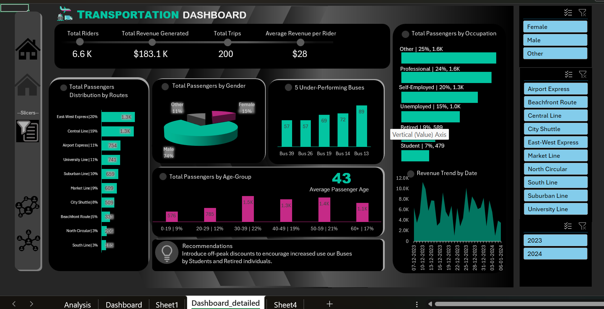

# 🚍 Transportation Analytics Dashboard
### End-to-End Business Intelligence Project using SQL Server & Microsoft Excel

<p align="center">


</p>

---

# 📖 Project Overview

The **Transportation Analytics Dashboard** is an end-to-end Business Intelligence project developed using **SQL Server** and **Microsoft Excel**.

Unlike traditional Excel dashboard projects that rely on pre-built datasets, this project begins with designing and creating a relational database in SQL Server. The transportation data was generated, stored, and managed using SQL queries before being connected to Microsoft Excel.

Using **Power Query**, the imported data was cleaned and transformed, and an interactive dashboard was developed with Pivot Tables, Pivot Charts, KPIs, and Slicers to provide actionable insights into transportation performance.

This project demonstrates the complete data analytics workflow from **database design to dashboard reporting**.

---

# 🎯 Business Problem

Transportation organizations generate large volumes of passenger and operational data daily. Analyzing this information manually is time-consuming and often fails to reveal important trends.

Key business questions include:

- Which routes carry the highest passenger volume?
- Which buses are underutilized or overcrowded?
- What are the busiest travel hours?
- How does passenger demand vary across months and years?
- Which weekdays require additional transportation resources?
- How efficiently is the transportation network operating?

The goal of this project is to transform raw transportation data into meaningful insights that support operational planning and business decision-making.

---

# 🎯 Project Objectives

- Design a transportation database in SQL Server.
- Create and populate relational tables using SQL.
- Connect SQL Server with Microsoft Excel.
- Clean and transform data using Power Query.
- Build an interactive transportation dashboard.
- Monitor operational KPIs.
- Analyze passenger demand and travel trends.
- Generate actionable business insights.

---

# 🏗️ Solution Architecture

```text
               SQL Server Database
                       │
                       ▼
              SQL Tables & Queries
                       │
                       ▼
          Microsoft Excel SQL Connection
                       │
                       ▼
             Power Query Transformation
                       │
                       ▼
          Pivot Tables & Pivot Charts
                       │
                       ▼
      Interactive Transportation Dashboard
```

---

# 🗄️ Database Development

The database was designed and developed in SQL Server from scratch.

### Database Tasks

- Database Creation
- Table Design
- Data Population
- SQL Queries
- Relationship Management
- Data Validation

---

# 🛠️ Technologies Used

| Technology | Purpose |
|------------|----------|
| SQL Server | Database Design & Storage |
| SQL | Table Creation, Data Insertion & Queries |
| Microsoft Excel | Dashboard Development |
| Power Query | ETL (Extract, Transform, Load) |
| Pivot Tables | Data Aggregation |
| Pivot Charts | Data Visualization |
| Slicers | Interactive Filtering |

---

# 🔄 Data Pipeline

### 1️⃣ Database Design

Created transportation database and tables using SQL Server.

↓

### 2️⃣ Data Population

Inserted transportation records through SQL scripts.

↓

### 3️⃣ SQL-Excel Integration

Connected SQL Server database directly to Microsoft Excel.

↓

### 4️⃣ Data Transformation

Performed data cleaning and transformation using Power Query.

↓

### 5️⃣ Dashboard Development

Built interactive reports using:

- Pivot Tables
- Pivot Charts
- KPI Cards
- Dynamic Slicers
- Conditional Formatting

---

# 📊 Dashboard Features

## 📌 KPI Cards

- 👥 Total Passengers
- 🚌 Total Trips
- 🛣️ Total Routes
- 📈 Average Passengers
- 🚍 Bus Utilization
- 📅 Passenger Growth

---

## 📈 Interactive Visualizations

- Monthly Passenger Trends
- Yearly Passenger Trends
- Passenger Distribution by Time Range
- Passenger Distribution (AM vs PM)
- Weekday Analysis
- Route Performance
- Peak Travel Hours
- Bus Utilization Analysis

---

## 🎛️ Interactive Filters

Users can filter dashboard data by:

- Year
- Month
- Route
- Weekday
- Time Range

---

# 📷 Dashboard Preview

## 🏠 Dashboard Overview

The overview page provides a high-level summary of transportation performance through KPI cards, trend analysis, and operational metrics.



---

## 📊 Detailed Dashboard

The detailed dashboard offers comprehensive analysis of passenger trends, route performance, utilization, and travel patterns.



---

## 🎛️ Interactive Filters

Interactive slicers enable users to explore data dynamically based on different dimensions.



---

# 📈 Key Business Insights

### 🚍 Peak Travel Hours

Identifies the busiest travel periods, enabling better scheduling and resource allocation.

---

### 🛣️ Route Performance

Compares passenger demand across transportation routes to identify high-performing and underperforming services.

---

### 📊 Bus Utilization

Categorizes buses into:

- 🔴 Under Utilized
- 🟢 Well Utilized
- 🟠 Over Utilized

This helps optimize fleet deployment.

---

### 📅 Passenger Trends

Analyzes passenger movement across months and years to identify seasonal demand patterns.

---

### 🌞 AM vs PM Analysis

Compares morning and evening passenger traffic to understand commuter behavior.

---

### 📍 Weekday Analysis

Highlights the busiest operating days for improved planning and scheduling.

---

# 💼 Business Value

This dashboard helps transportation managers to:

- Optimize fleet utilization
- Improve route planning
- Reduce operational inefficiencies
- Monitor passenger demand
- Allocate transportation resources effectively
- Support strategic decision-making
- Enhance service quality

---

# 📂 Repository Structure

```text
Transportation/
│
├── Assets/
│   ├── Overview.png
│   ├── Detailed.png
│   └── Filter.png
│
├── Query.sql
├── Transportation_Dashboard.xlsm
├── README.md
├── LICENSE
└── .gitignore
```

---

# 🚀 Future Enhancements

- Live SQL Server Database Connection
- Automated Dashboard Refresh
- Power BI Version
- Route Profitability Analysis
- Passenger Demand Forecasting
- Geographic Route Mapping
- Fuel Consumption Dashboard

---

# 💡 Skills Demonstrated

### Database Development

- SQL Server
- SQL Query Writing
- Relational Database Design
- Data Modeling

### Data Processing

- SQL to Excel Integration
- Power Query
- Data Cleaning
- Data Transformation
- ETL Process

### Data Analysis

- KPI Development
- Business Analysis
- Trend Analysis
- Data Storytelling

### Dashboard Development

- Microsoft Excel
- Pivot Tables
- Pivot Charts
- Interactive Slicers
- Conditional Formatting

---

# 🌟 Project Highlights

✅ End-to-End BI Project

✅ SQL Database Designed from Scratch

✅ SQL Server Connected to Excel

✅ Power Query Data Transformation

✅ Interactive Dashboard

✅ Dynamic KPI Reporting

✅ Business-Oriented Insights

✅ Professional Dashboard Design

---

# 🤝 Connect With Me

**Anusree M A**

💼 LinkedIn: https://linkedin.com/in/anusree-ma

📊 Tableau Public: https://public.tableau.com/app/profile/anusree.m.a

💻 GitHub: https://github.com/Anusree-MA

---

## ⭐ Support

If you found this project useful, consider giving it a **⭐ Star** on GitHub.

Your support motivates me to build and share more data analytics projects!

---
**Made with ❤️ using SQL Server, Microsoft Excel, and Power Query**
